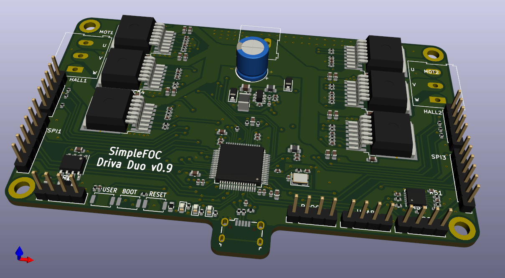
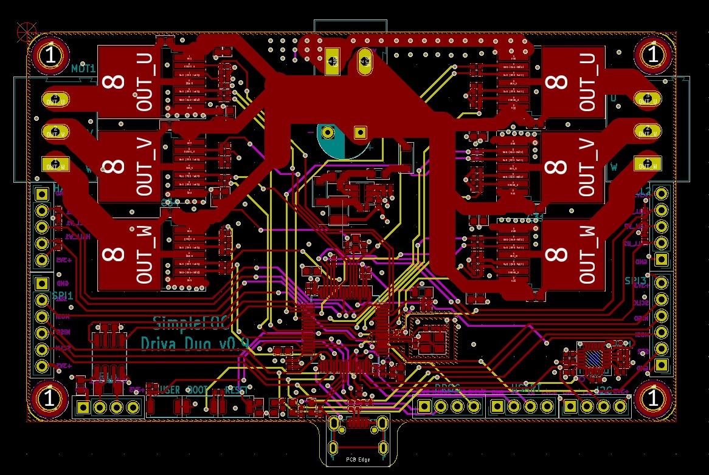

# driva-x2
Experimental dual BLDC board for use with [SimpleFOC](https://simplefoc.com)

[PDF Schematic](./kicad/docs/driva-x2.pdf)

The gerber files are here:
https://github.com/owennewo/driva-x2/tree/main/kicad/gerber

The BOM and Pick/Place/POS file are here:
https://github.com/owennewo/driva-x2/tree/main/kicad/assembly

v0.5 - First attempt (partly working - problems with mpu6050, can and LDO)
v0.9 - Second attempt (fixed above hopefully - awaiting order from JLCPCB)
